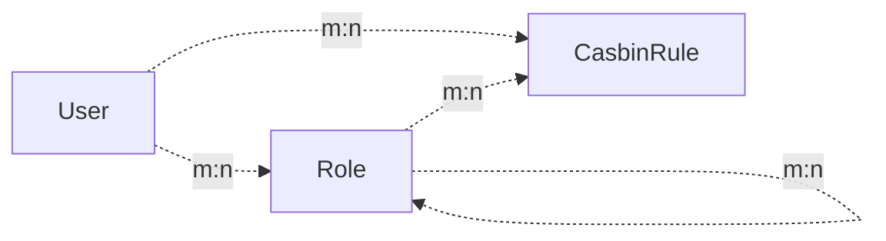

[简体中文](https://github.com/Mkadir/fastapi-user-auth/blob/master/README.zh.md)
| [English](https://github.com/Mkadir/fastapi-user-auth)
# Project Introduction
<h2 align="center">
  FastAPI-User-Auth
</h2><p align="center">
    <em>FastAPI-User-Auth is a simple and powerful FastAPI user authentication and authorization library based on Casbin.</em><br/>
    <em>Based on FastAPI-Amis-Admin and provides a freely extensible visual management interface.</em>
</p>
<p align="center">
    <a href="https://github.com/amisadmin/fastapi_amis_admin/actions/workflows/pytest.yml" target="_blank">
        
    </a>
    <a href="https://pypi.org/project/fastapi_user_auth" target="_blank">
        
    </a>
    <a href="https://pepy.tech/project/fastapi-user-auth" target="_blank">
        
    </a>
    <a href="https://gitter.im/amisadmin/fastapi-amis-admin">
        
    </a>
    <a href="https://jq.qq.com/?_wv=1027&k=U4Dv6x8W" target="_blank">
        
    </a>
</p>
<p align="center">
  <a href="https://github.com/amisadmin/fastapi_user_auth" target="_blank">Source code</a>
  ·
  <a href="http://user-auth.demo.amis.work/" target="_blank">Online demo</a>
  ·
  <a href="http://docs.amis.work" target="_blank">Documentation</a>
  ·
  <a href="http://docs.gh.amis.work" target="_blank"> can't open the document ？</a>
</p>

------
`FastAPI-User-Auth` is a API based on [FastAPI-Amis-Admin](https://github.com/amisadmin/fastapi_amis_admin)
The application plug-in is deeply integrated with `FastAPI-Amis-Admin` to provide user authentication and authorization.
Casbin-based RBAC permission management supports multiple verification methods, multiple databases, and multiple granularity permission controls.

### Permission types
- **Page Permissions**: Control whether the user can access a certain menu page. If it is not accessible, the menu will not be displayed, and all routes under the page will be inaccessible.
- **Action Permission**: Controls whether the user can perform an action and whether the button is displayed. For example: add, update, delete, etc.
- **Field permissions**: Control whether users can operate a certain field. For example: list display fields, filter fields, add fields, update fields, etc.
- **Data permissions**: Control the range of data that users can operate. For example: they can only operate the data they created, only the data of the last 7 days, etc.


## Installation
```bash
pip install fastapi-user-auth
```
## Simple example
```python
from fastapi import FastAPI
from fastapi_amis_admin.admin.settings import Settings
from fastapi_user_auth.site import AuthAdminSite
from starlette.requests import Request
from sqlmodel import SQLModel

# Create FastAPI application
app = FastAPI()

# Create AdminSite instance
site = AuthAdminSite(settings=Settings(database_url='sqlite:///amisadmin.db?check_same_thread=False'))
auth = site.auth
# Mount the backend management system
site.mount_app(app)


# Create initial database table
@app.on_event("startup")
async def startup():
    await site.db.async_run_sync(SQLModel.metadata.create_all, is_session=False)
    # Create a default administrator, username: admin, password: admin, please change the password in time!!!
    await auth.create_role_user("admin")
    #Create the default super administrator, username: root, password: root, please change the password in time!!!    await auth.create_role_user("root")
    # Run the startup method of the site, load the casbin strategy, etc.
    await site.router.startup()
    #Add a default casbin rule
    if not auth.enforcer.enforce("u:admin", site.unique_id, "page", "page"):
        await auth.enforcer.add_policy("u:admin", site.unique_id, "page", "page", "allow")


# Requirements: User must be logged in
@app.get("/auth/get_user")
@auth.requires()
def get_user(request: Request):
    return request.user


if __name__ == '__main__':
    import uvicorn

    uvicorn.run(app)

```

## Authentication methods
### Decorator
- Recommended scenario: Single route. Supports synchronous/asynchronous routing.
```python
# Requirements: User must be logged in
@app.get("/auth/user")
@auth.requires()
def user(request: Request):
    return request.user  # Current request user object.


# Verify routing: user has admin role
@app.get("/auth/admin_roles")
@auth.requires('admin')
def admin_roles(request: Request):
    return request.user


# Requirement: User has VIP role
#Support synchronous/asynchronous routing
@app.get("/auth/vip_roles")
@auth.requires(['vip'])
async def vip_roles(request: Request):
    return request.user


# Requirement: User has admin role or vip role
@app.get("/auth/admin_or_vip_roles")
@auth.requires(roles=['admin', 'vip'])
def admin_or_vip_roles(request: Request):
    return request.user
```
### Dependencies (recommended)
- Recommended scenarios: single route, route set, FastAPI application.

```python
from fastapi import Depends
from fastapi_user_auth.auth.models import User


# Route parameter dependencies, this method is recommended
@app.get("/auth/admin_roles_depend_1")
def admin_roles(user: User = Depends(auth.get_current_user)):
    return user  # Current request user object.


# Path manipulation decorator dependencies
@app.get("/auth/admin_roles_depend_2", dependencies=[Depends(auth.requires('admin')())])
def admin_roles(request: Request):
    return request.user


# Global dependencies
# All requests under the app require the admin role
app = FastAPI(dependencies=[Depends(auth.requires('admin')())])


@app.get("/auth/admin_roles_depend_3")
def admin_roles(request: Request):
    return request.user

```
### Middleware
- Recommended scenario: FastAPI application
```python
app = FastAPI()
# Attach `request.auth` and `request.user` objects before each request is processed under the app application
auth.backend.attach_middleware(app)
```

### Call directly

- Recommended scenario: non-routing method
```python
from fastapi_user_auth.auth.models import User


async def get_request_user(request: Request) -> Optional[User]:
    # user= await auth.get_current_user(request)
    if await auth.requires('admin', response=False)(request):
        return request.user
    else:
        return None
```

## Token Storage Backend
`fastapi-user-auth` supports multiple token storage methods. The default is: `DbTokenStore`, it is recommended to customize it to: `JwtTokenStore`

### JwtTokenStore
- ` pip install fastapi-user-auth[jwt] `

```python
from fastapi_user_auth.auth.backends.jwt import JwtTokenStore
from sqlalchemy_database import Database
from fastapi_user_auth.auth import Auth
from fastapi_amis_admin.admin.site import AuthAdminSite

#Create a sync database engine
db = Database.create(url="sqlite:///amisadmin.db?check_same_thread=False")

# Use `JwtTokenStore` to create an auth object
auth = Auth(
    db=db,
    token_store=JwtTokenStore(secret_key='09d25e094faa6ca2556c818166b7a9563b93f7099f6f0f4caa6cf63b88e8d3e7')
)

# Pass auth object to AdminSite
site = AuthAdminSite(
    settings=Settings(),
    db=db,
    auth=auth
)

```

### DbTokenStore
```python
# Create an auth object using `DbTokenStore`
from fastapi_user_auth.auth.backends.db import DbTokenStore

auth = Auth(
    db=db,
    token_store=DbTokenStore(db=db)
)
```
### RedisTokenStore

- `pip install fastapi-user-auth[redis] `

```python
# Use `RedisTokenStore` to create an auth object
from fastapi_user_auth.auth.backends.redis import RedisTokenStore
from redis.asyncio import Redis

auth = Auth(
    db=db,
    token_store=RedisTokenStore(redis=Redis.from_url('redis://localhost?db=0'))
)
```
## RBAC model
This system adopts the `Casbin RBAC` model and runs a role-based priority strategy.
- Permissions can be assigned to roles or directly to users.
- Users can have multiple roles.
- A role can have multiple sub-roles.
- The permission policy owned by the user has a higher priority than the permission policy of the role it owns.



## Advanced expansion
### Extend the `User` model

```python
from datetime import date

from fastapi_amis_admin.models.fields import Field
from fastapi_user_auth.auth.models import BaseUser

# Customize the `User` model, inherit `BaseUser`
class MyUser(BaseUser, table = True):
    point: float = Field(default = 0, title = 'Point', description = 'User points')
    phone: str = Field(None, title = 'Phone', max_length = 15)
    parent_id: int = Field(None, title = "Superior", foreign_key = "auth_user.id")
    birthday: date = Field(None, title = "date of birth")
    location: str = Field(None, title = "Location")

# Use custom `User` model to create auth object
auth = Auth(db = AsyncDatabase(engine), user_model = MyUser)
```

### Extend the `Role` model

```python
from fastapi_amis_admin.models.fields import Field
from fastapi_user_auth.auth.models import Role


# Customize `Role` model, inherit `Role`;
class MyRole(Role, table=True):
    icon: str = Field(None, title='图标')
    is_active: bool = Field(default=True, title="是否激活")

```

### Customize `User Auth App` default management class

The default management classes can be overridden and replaced through inheritance.
For example: `UserLoginFormAdmin`, `UserRegFormAdmin`, `UserInfoFormAdmin`,
`UserAdmin`,`RoleAdmin`

```python
# Customize the model management class, inherit and override the corresponding default management class
class MyRoleAdmin(admin.ModelAdmin):
    page_schema = PageSchema(label='User group management', icon='fa fa-group')
    model = MyRole
    readonly_fields = ['key']


# Customize user authentication application, inherit and override the default user authentication application
class MyUserAuthApp(UserAuthApp):
    RoleAdmin = MyRoleAdmin


# Customize the user management site, inherit and override the default user management site
class MyAuthAdminSite(AuthAdminSite):
    UserAuthApp = MyUserAuthApp


# Use the custom `AuthAdminSite` class to create a site object
site = MyAuthAdminSite(settings, auth=auth)
```

## ModelAdmin permission control

### Field permissions

- Inherit the `AutoField ModelAdmin` class to achieve field permission control. By assigning user and role permissions in the background.

- `perm_fields_exclude`: Specify fields that do not require permission control.

```python
from fastapi_user_auth.mixins.admin import AuthFieldModelAdmin
from fastapi_amis_admin.amis import PageSchema
from fastapi_amis_admin.admin import FieldPermEnum

class AuthFieldArticleAdmin(AuthFieldModelAdmin):
    page_schema = PageSchema(label="文章管理")
    model = Article
    # Specify fields that do not need permission control. 
    perm_fields_exclude = {
        FieldPermEnum.CREATE: ["title", "description", "content"],
    }
```

### Data permissions

- Inherit the `AuthSelectModelAdmin` class to achieve data permission control. By assigning user and role permissions in the background.
- `select_permisions`: Specify permissions to query data.

```python
from fastapi_user_auth.mixins.admin import AuthSelectModelAdmin
from fastapi_amis_admin.amis import PageSchema
from fastapi_amis_admin.admin import RecentTimeSelectPerm, UserSelectPerm, SimpleSelectPerm


class AuthSelectArticleAdmin(AuthSelectModelAdmin):
    page_schema = PageSchema(label="Dataset control article management")
    model = Article
    select_permissions = [
        # Data created in the last 7 days. reverse=True indicates reverse selection, that is, the data within the last 7 days is selected by default.
        RecentTimeSelectPerm(name="recent7_create", label="Created in the last 7 days", td=60 * 60 * 24 * 7, reverse=True),
        # Data created in the last 30 days
        RecentTimeSelectPerm(name="recent30_create", label="Created in the last 30 days", td=60 * 60 * 24 * 30),
        #Data updated in the last 3 days
        RecentTimeSelectPerm(name="recent3_update", label="Updated in the last 3 days", td=60 * 60 * 24 * 3, time_column="update_time"),
        # You can only select the data you created. reverse=True means reverse selection, that is, the data you created is selected by default.
        
        UserSelectPerm(name="self_create", label="Create yourself", user_column="user_id", reverse=True),
        # # You can only select the data you updated
        # UserSelectPerm(name="self_update", label="Update yourself", user_column="update_by"),
        # Only published data can be selected
        SimpleSelectPerm(name="published", label="Published", column="is_published", values=[True]),
        # Only data with status [1,2,3] can be selected
        SimpleSelectPerm(name="status_1_2_3", label="Status is 1_2_3", column="status", values=[1, 2, 3]),
    ]
```

## Interface preview

- Open `http://127.0.0.1:8000/admin/auth/form/login` in your browser:


- Open `http://127.0.0.1:8000/admin/` in your browser:


- Open `http://127.0.0.1:8000/admin/docs` in your browser:


## License Agreement

- `fastapi-amis-admin` is open source and free to use based on `Apache2.0` and can be used for commercial purposes for free, but please clearly display the copyright information about FastAPI-Amis-Admin in the display interface.
## Thanks

Thanks to the following developers for their contributions to FastAPI-User-Auth:

<a href="https://github.com/amisadmin/fastapi_user_auth/graphs/contributors">
  
</a>