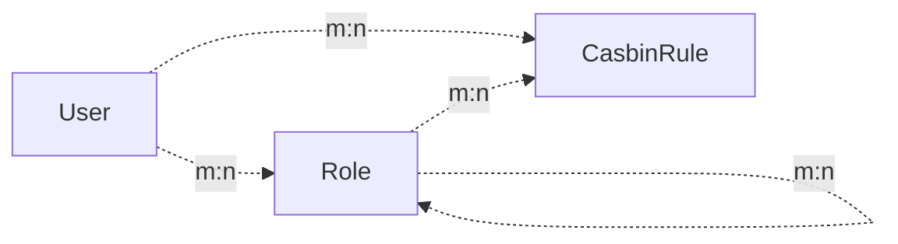

# Project Introduction<h2 align="center">
  FastAPI-User-Auth
</h2>
<p align="center">
    <em>FastAPI-User-Auth is a simple and powerful FastAPI user authentication and authorization library based on Casbin.</em><br/>
    <em>It is deeply integrated with FastAPI-Amis-Admin and provides a customizable visual management interface.</em>
</p>
<p align="center">
    <a href="https://github.com/amisadmin/fastapi_amis_admin/actions/workflows/pytest.yml" target="_blank">
        
    </a>
    <a href="https://pypi.org/project/fastapi_user_auth" target="_blank">
        
    </a>
    <a href="https://pepy.tech/project/fastapi-user-auth" target="_blank">
        
    </a>
    <a href="https://gitter.im/amisadmin/fastapi-amis-admin">
        
    </a>
    <a href="https://jq.qq.com/?_wv=1027&k=U4Dv6x8W" target="_blank">
        
    </a>
</p>
<p align="center">
  <a href="https://github.com/amisadmin/fastapi_user_auth" target="_blank">Source Code</a>
  ·
  <a href="http://user-auth.demo.amis.work/" target="_blank">Online Demo</a>
  ·
  <a href="http://docs.amis.work" target="_blank">Documentation</a>
  ·
  <a href="http://docs.gh.amis.work" target="_blank">Documentation Not Accessible?</a>
</p>

------

`FastAPI-User-Auth` is an application plugin based on [FastAPI-Amis-Admin](https://github.com/amisadmin/fastapi_amis_admin) ,
deeply integrated with `FastAPI-Amis-Admin`, providing user authentication and authorization. It is based on Casbin for RBAC (Role-Based Access Control) management, supporting various authentication methods, multiple databases, and different levels of permission control.
### Types of Permissions 
- **Page Permission** : Controls whether a user can access a specific menu page. If not accessible, the menu will not be displayed, and all routes under the page will also be inaccessible. 
- **Action Permission** : Controls whether a user can perform a specific action, such as adding, updating, deleting, etc., and whether the corresponding buttons are visible. 
- **Field Permission** : Controls whether a user can operate on a specific field, such as display fields, filter fields, add fields, update fields, etc. 
- **Data Permission** : Controls the data range a user can operate on, such as only being able to operate on self-created data or data from the last 7 days.
## Installation

```bash
pip install fastapi-user-auth
```


## Simple Example

```python
from fastapi import FastAPI
from fastapi_amis_admin.admin.settings import Settings
from fastapi_user_auth.site import AuthAdminSite
from starlette.requests import Request
from sqlmodel import SQLModel

# Create a FastAPI application
app = FastAPI()

# Create an AdminSite instance
site = AuthAdminSite(settings=Settings(database_url='sqlite:///amisadmin.db?check_same_thread=False'))
auth = site.auth
# Mount the admin system
site.mount_app(app)

# Create and initialize database tables
@app.on_event("startup")
async def startup():
    await site.db.async_run_sync(SQLModel.metadata.create_all, is_session=False)
    # Create a default administrator, username: admin, password: admin, please change the password promptly!!!
    await auth.create_role_user("admin")
    # Create a default super administrator, username: root, password: root, please change the password promptly!!!
    await auth.create_role_user("root")
    # Run the startup method of the site, load casbin policies, etc.
    await site.router.startup()
    # Add a default casbin rule
    if not auth.enforcer.enforce("u:admin", site.unique_id, "page", "page"):
        await auth.enforcer.add_policy("u:admin", site.unique_id, "page", "page", "allow")

# Requires: User must be logged in
@app.get("/auth/get_user")
@auth.requires()
def get_user(request: Request):
    return request.user

if __name__ == '__main__':
    import uvicorn

    uvicorn.run(app)
```


## Authentication Methods
### Decorators
- Recommended for: individual routes. Supports synchronous/asynchronous routes.

```python
# Requires: User must be logged in
@app.get("/auth/user")
@auth.requires()
def user(request: Request):
    return request.user  # Current request user object.

# Route with validation: User has the 'admin' role
@app.get("/auth/admin_roles")
@auth.requires('admin')
def admin_roles(request: Request):
    return request.user

# Requires: User has the 'vip' role
# Supports synchronous/asynchronous routes
@app.get("/auth/vip_roles")
@auth.requires(['vip'])
async def vip_roles(request: Request):
    return request.user

# Requires: User has the 'admin' role or 'vip' role
@app.get("/auth/admin_or_vip_roles")
@auth.requires(roles=['admin', 'vip'])
def admin_or_vip_roles(request: Request):
    return request.user
```


### Dependencies (Recommended)
- Recommended for: individual routes, route collections, FastAPI applications.

```python
from fastapi import Depends
from fastapi_user_auth.auth.models import User

# Route parameter dependency, recommended to use this approach
@app.get("/auth/admin_roles_depend_1")
def admin_roles(user: User = Depends(auth.get_current_user)):
    return user  # or request.user

# Path operation decorator dependency
@app.get("/auth/admin_roles_depend_2", dependencies=[Depends(auth.requires('admin')())])
def admin_roles(request: Request):
    return request.user

# Global dependency: All requests under the app require the 'admin' role
app = FastAPI(dependencies=[Depends(auth.requires('admin')())])

@app.get("/auth/admin_roles_depend_3")
def admin_roles(request: Request):
    return request.user
```


### Middleware
- Recommended for: FastAPI applications

```python
app = FastAPI()
# Attach `request.auth` and `request.user` objects to every request handled under the app
auth.backend.attach_middleware(app)
```


### Direct Invocation
- Recommended for: non-route methods

```python
from fastapi_user_auth.auth.models import User

async def get_request_user(request: Request) -> Optional[User]:
    # user = await auth.get_current_user(request)
    if await auth.requires('admin', response=False)(request):
        return request.user
    else:
        return None
```


## Token Storage Backends

`fastapi-user-auth` supports multiple token storage methods. The default is `DbTokenStore`, but it is recommended to customize it to `JwtTokenStore`.
### JwtTokenStore
```bash
pip install fastapi-user-auth[jwt]
```

```python
from fastapi_user_auth.auth.backends.jwt import JwtTokenStore
from sqlalchemy_database import Database
from fastapi_user_auth.auth import Auth
from fastapi_amis_admin.admin.site import AuthAdminSite

# Create a synchronous database engine
db = Database.create(url="sqlite:///amisadmin.db?check_same_thread=False")

# Use `JwtTokenStore` to create the auth object
auth = Auth(
    db=db,
    token_store=JwtTokenStore(secret_key='09d25e094faa6ca2556c818166b7a9563b93f7099f6f0f4caa6cf63b88e8d3e7')
)

# Pass the auth object into AdminSite
site = AuthAdminSite(
    settings=Settings(),
    db=db,
    auth=auth
)
```


### DbTokenStore

```python
# Use `DbTokenStore` to create the auth object
from fastapi_user_auth.auth.backends.db import DbTokenStore

auth = Auth(
    db=db,
    token_store=DbTokenStore(db=db)
)
```


### RedisTokenStore
```bash
pip install fastapi-user-auth[redis]
```

```python
# Use `RedisTokenStore` to create the auth object
from fastapi_user_auth.auth.backends.redis import RedisTokenStore
from redis.asyncio import Redis

auth = Auth(
    db=db,
    token_store=RedisTokenStore(redis=Redis.from_url('redis://localhost?db=0'))
)
```


## RBAC Model

This system uses the `Casbin RBAC` model and operates based on a role-priority strategy.
- Permissions can be assigned to roles or directly to users.
- A user can have multiple roles.
- A role can have multiple sub-roles.
- The permission policy owned by a user takes precedence over the permission policy of the roles they possess.




## Advanced Extensions
### Extending the `User` Model

```python
from datetime import date

from fastapi_amis_admin.models.fields import Field
from fastapi_user_auth.auth.models import User

# Custom `User` model, inherits from `User`
class MyUser(User, table=True):
    point: float = Field(default=0, title='Points', description='User points')
    phone: str = Field(None, title='Phone Number', max_length=15)
    parent_id: int = Field(None, title="Parent", foreign_key="auth_user.id")
    birthday: date = Field(None, title="Birthday")
    location: str = Field(None, title="Location")

# Create the auth object using the custom `User` model
auth = Auth(db=AsyncDatabase(engine), user_model=MyUser)
```


### Extending the `Role` Model

```python
from fastapi_amis_admin.models.fields import Field
from fastapi_user_auth.auth.models import Role

# Custom `Role` model, inherits from `Role`;
class MyRole(Role, table=True):
    icon: str = Field(None, title='Icon')
    is_active: bool = Field(default=True, title="Is Active")
```


### Customizing the Default Management Class for `UserAuthApp`

Default management classes can be overridden by inheritance and reimplementation. For example: `UserLoginFormAdmin`, `UserRegFormAdmin`, `UserInfoFormAdmin`, `UserAdmin`, `RoleAdmin`.

```python
# Custom model management class, inherit and override the corresponding default management class
class MyRoleAdmin(admin.ModelAdmin):
    page_schema = PageSchema(label='User Group Management', icon='fa fa-group')
    model = MyRole
    readonly_fields = ['key']

# Custom user authentication application, inherit and override the default user authentication application
class MyUserAuthApp(UserAuthApp):
    RoleAdmin = MyRoleAdmin

# Custom user management site, inherit and override the default user management site
class MyAuthAdminSite(AuthAdminSite):
    UserAuthApp = MyUserAuthApp

# Create the site object using the custom `AuthAdminSite` class
site = MyAuthAdminSite(settings, auth=auth)
```


## ModelAdmin Permission Control
### Field Permissions 
- Inherit from `AuthFieldModelAdmin` class to implement field permission control. Assign user and role permissions in the admin interface. 
- `perm_fields_exclude`: Specify fields that do not require permission control.

```python
from fastapi_user_auth.mixins.admin import AuthFieldModelAdmin
from fastapi_amis_admin.amis import PageSchema
from fastapi_amis_admin.admin import FieldPermEnum

class AuthFieldArticleAdmin(AuthFieldModelAdmin):
    page_schema = PageSchema(label="Article Management")
    model = Article
    # Specify fields that do not require permission control
    perm_fields_exclude = {
        FieldPermEnum.CREATE: ["title", "description", "content"],
    }
```


### Data Permissions 
- Inherit from `AuthSelectModelAdmin` class to implement data permission control. Assign user and role permissions in the admin interface. 
- `select_permisions`: Specify data query permissions.

```python
from fastapi_user_auth.mixins.admin import AuthSelectModelAdmin
from fastapi_amis_admin.amis import PageSchema
from fastapi_amis_admin.admin import RecentTimeSelectPerm, UserSelectPerm, SimpleSelectPerm

class AuthSelectArticleAdmin(AuthSelectModelAdmin):
    page_schema = PageSchema(label="Data-Controlled Article Management")
    model = Article
    select_permissions = [
        # Data created within the last 7 days. reverse=True means select in reverse, i.e., by default select data from the last 7 days
        RecentTimeSelectPerm(name="recent7_create", label="Recent 7 Days Created", td=60 * 60 * 24 * 7, reverse=True),
        # Data created within the last 30 days
        RecentTimeSelectPerm(name="recent30_create", label="Recent 30 Days Created", td=60 * 60 * 24 * 30),
        # Data updated within the last 3 days
        RecentTimeSelectPerm(name="recent3_update", label="Recent 3 Days Updated", td=60 * 60 * 24 * 3, time_column="update_time"),
        # Can only select self-created data, reverse=True means select in reverse, i.e., by default select self-created data
        UserSelectPerm(name="self_create", label="Self Created", user_column="user_id", reverse=True),
        # Can only select self-updated data
        # UserSelectPerm(name="self_update", label="Self Updated", user_column="update_by"),
        # Can only select published data
        SimpleSelectPerm(name="published", label="Published", column="is_published", values=[True]),
        # Can only select data with status [1,2,3]
        SimpleSelectPerm(name="status_1_2_3", label="Status 1, 2, 3", column="status", values=[1, 2, 3]),
    ]
```


## Interface Preview 
- Open `http://127.0.0.1:8000/admin/auth/form/login` in your browser:

 
 
- Open `http://127.0.0.1:8000/admin/` in your browser:

 
 
- Open `http://127.0.0.1:8000/admin/docs` in your browser:

 

## License 
- `fastapi-amis-admin` is open source and free to use under the `Apache2.0` license. It can be used for free for commercial purposes, but please clearly display copyright information about FastAPI-Amis-Admin in the display interface.
## Acknowledgments

Thanks to the developers who contributed to FastAPI-User-Auth:
<a href="https://github.com/amisadmin/fastapi_user_auth/graphs/contributors">
  
</a>
