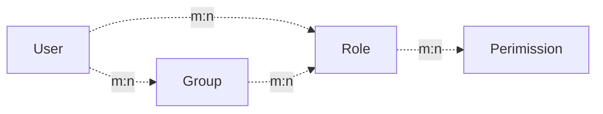

[简体中文](https://github.com/amisadmin/fastapi_user_auth/blob/master/README.zh.md)
| [English](https://github.com/amisadmin/fastapi_user_auth)

# Project Introduction

<h2 align="center">
  FastAPI-User-Auth
</h2>
<p align="center">
    <em>FastAPI-User-Auth is a simple and powerful FastAPI user RBAC authentication and authorization library.</em><br/>
    <em>It is based on FastAPI-Amis-Admin and provides a freely extensible visual management interface.</em>
</p>
<p align="center">
    <a href="https://github.com/amisadmin/fastapi_amis_admin/actions/workflows/pytest.yml" target="_blank">
        
    </a>
    <a href="https://pypi.org/project/fastapi_user_auth" target="_blank">
        
    </a>
    <a href="https://pepy.tech/project/fastapi-user-auth" target="_blank">
        
    </a>
    <a href="https://gitter.im/amisadmin/fastapi-amis-admin">
        
    </a>
    <a href="https://jq.qq.com/?_wv=1027&k=U4Dv6x8W" target="_blank">
        
    </a>
</p>
<p align="center">
  <a href="https://github.com/amisadmin/fastapi_user_auth" target="_blank">SourceCode</a>
  ·
  <a href="http://user-auth.demo.amis.work/" target="_blank">OnlineDemo</a>
  ·
  <a href="http://docs.amis.work" target="_blank">Documentation</a>
  ·
  <a href="http://docs.gh.amis.work" target="_blank">Can't open the document？</a>
</p>

------

`FastAPI-User-Auth` It is an application plug -in based on [FastAPI-Amis-Admin](https://github.com/amisadmin/fastapi_amis_admin)
, which is deeply integrated to provide user authentication and authorization..

## Install

```bash
pip install fastapi-user-auth
```

## Simple example

```python
from fastapi import FastAPI
from fastapi_amis_admin.admin.settings import Settings
from fastapi_user_auth.site import AuthAdminSite
from starlette.requests import Request
from sqlmodel import SQLModel

# Create Fast API application
app = FastAPI()

# Create an Admin Site instance
site = AuthAdminSite(settings=Settings(database_url_async='sqlite+aiosqlite:///amisadmin.db'))
auth = site.auth
# Mount the Site management system to the FastAPI instance
site.mount_app(app)

# Create initialization database table
@app.on_event("startup")
async def startup():
    await site.db.async_run_sync(SQLModel.metadata.create_all, is_session=False)
    # Create default admin user,user name:admin,password:admin,please change it after login!!!
    await auth.create_role_user('admin')
    await auth.create_role_user('vip')

# Requirements: User must be logged in
@app.get("/auth/get_user")
@auth.requires()
def get_user(request: Request):
    return request.user

if __name__ == '__main__':
    import uvicorn

    uvicorn.run(app, debug=True)

```

## Ways of identifying

### Decorator

- Recommended scenario: Single route. Supports synchronous and asynchronous routing.

```python
# Requirements: User must be logged in
@app.get("/auth/user")
@auth.requires()
def user(request: Request):
    return request.user  # current request user object.

# Authentication route: user has admin role
@app.get("/auth/admin_roles")
@auth.requires('admin')
def admin_roles(request: Request):
    return request.user

# Requirement: User has vip role
# Support synchronous and asynchronous routing
@app.get("/auth/vip_roles")
@auth.requires(['vip'])
async def vip_roles(request: Request):
    return request.user

# Requirements: User has admin role or vip role
@app.get("/auth/admin_or_vip_roles")
@auth.requires(roles=['admin', 'vip'])
def admin_or_vip_roles(request: Request):
    return request.user

# Requirement: The user belongs to the admin user group
@app.get("/auth/admin_groups")
@auth.requires(groups=['admin'])
def admin_groups(request: Request):
    return request.user

# Requirements: The user has the admin role and belongs to the admin user group
@app.get("/auth/admin_roles_and_admin_groups")
@auth.requires(roles=['admin'], groups=['admin'])
def admin_roles_and_admin_groups(request: Request):
    return request.user

# Requirements: The user has the vip role and has the `article:update` permission
@app.get("/auth/vip_roles_and_article_update")
@auth.requires(roles=['vip'], permissions=['article:update'])
def vip_roles_and_article_update(request: Request):
    return request.user

```

### Dependencies (recommended)

- Recommended scenarios: single route, route collection, FastAPI application.

```python
from fastapi import Depends
from typing import Tuple
from fastapi_user_auth.auth import Auth
from fastapi_user_auth.auth.models import User

# Route parameter dependencies, this method is recommended
@app.get("/auth/admin_roles_depend_1")
def admin_roles(user: User = Depends(auth.get_current_user)):
    return user  # or request.user

# Path manipulation decorator dependencies
@app.get("/auth/admin_roles_depend_2", dependencies=[Depends(auth.requires('admin')())])
def admin_roles(request: Request):
    return request.user

# Global dependencies
# All requests under the app application require the admin role
app = FastAPI(dependencies=[Depends(auth.requires('admin')())])

@app.get("/auth/admin_roles_depend_3")
def admin_roles(request: Request):
    return request.user

```

### Middleware

- Recommended Scenario: FastAPI Application

```python
app = FastAPI()
# Append `request.auth` and `request.user` objects before each request processing under the app
auth.backend.attach_middleware(app)

```

### Call directly

- Recommended scenarios: non-routing methods

```python
from fastapi_user_auth.auth.models import User

async def get_request_user(request: Request) -> Optional[User]:
    # user= await auth.get_current_user(request)
    if await auth.requires('admin', response=False)(request):
        return request.user
    else:
        return None

```

## Token storage backend

`fastapi-user-auth` Supports multiple token storage methods. The default is: `DbTokenStore`, It is recommended to customize the modification to: `JwtTokenStore`

### JwtTokenStore

```python
from fastapi_user_auth.auth.backends.jwt import JwtTokenStore
from sqlalchemy.ext.asyncio import create_async_engine
from sqlalchemy_database import AsyncDatabase

# Create an asynchronous database engine
engine = create_async_engine(url='sqlite+aiosqlite:///amisadmin.db', future=True)
# Create auth object using `Jwt Token Store`
auth = Auth(
    db=AsyncDatabase(engine),
    token_store=JwtTokenStore(secret_key='09d25e094faa6ca2556c818166b7a9563b93f7099f6f0f4caa6cf63b88e8d3e7')
)

# Pass the auth object into the Admin Site
site = AuthAdminSite(
    settings=Settings(database_url_async='sqlite+aiosqlite:///amisadmin.db'),
    auth=auth
)

```

### DbTokenStore

```python
# Create auth object using `Db Token Store`
from fastapi_user_auth.auth.backends.db import DbTokenStore

auth = Auth(
    db=AsyncDatabase(engine),
    token_store=DbTokenStore(db=AsyncDatabase(engine))
)
```

### RedisTokenStore

```python
# Create auth object using `Redis Token Store`
from fastapi_user_auth.auth.backends.redis import RedisTokenStore
from aioredis import Redis

auth = Auth(
    db=AsyncDatabase(engine),
    token_store=RedisTokenStore(redis=Redis.from_url('redis://localhost?db=0'))
)
```

## RBAC model

The `RBAC` model adopted by this system is as follows, you can also expand it according to your own needs.

- Reference: [Design of Permission System](https://blog.csdn.net/qq_25889465/article/details/98473611)



## Advanced Extension

```bash
### Extending the `User` model

```python
from datetime import date

from fastapi_amis_admin.models.fields import Field
from fastapi_user_auth.auth.models import User

# Customize `User` model, inherit `User`
class MyUser(User, table = True):
    point: float = Field(default = 0, title = 'Source', description = 'User source')
    phone: str = Field(None, title = 'Phone number', max_length = 15)
    parent_id: int = Field(None, title = "Superior", foreign_key = "auth_user.id")
    birthday: date = Field(None, title = "Date of birth")
    location: str = Field(None, title = "Location")

# Create an auth object using a custom `User` model
auth = Auth(db = AsyncDatabase(engine), user_model = MyUser)
```

### Extend the `Role`, `Group`, `Permission` models

```python
from fastapi_amis_admin.models.fields import Field
from fastapi_user_auth.auth.models import Group

# Customize the `Group` model, inherit `Base RBAC`; override the `Role`, the `Permission` model is similar, 
# the difference is the table name.
class MyGroup(Group, table=True):
    __tablename__ = 'auth_group'  # Database table name, must be this to override the default model
    icon: str = Field(None, title='Icon')
    is_active: bool = Field(default=True, title="Activate now")

```

### Custom `User Auth App` default management class

Default management classes can be overridden and replaced by inheritance.
For Example: `UserLoginFormAdmin`,`UserRegFormAdmin`,`UserInfoFormAdmin`,
`UserAdmin`,`GroupAdmin`,`RoleAdmin`,`PermissionAdmin`

```python
# Customize the model management class, inherit and override the corresponding default management class
class MyGroupAdmin(admin.ModelAdmin):
    page_schema = PageSchema(label='用户组管理', icon='fa fa-group')
    model = MyGroup
    link_model_fields = [Group.roles]
    readonly_fields = ['key']

# Customize the user authentication application, inherit and override the default user authentication application
class MyUserAuthApp(UserAuthApp):
    GroupAdmin = MyGroupAdmin

# Customize the user management site, inherit and override the default user management site
class MyAuthAdminSite(AuthAdminSite):
    UserAuthApp = MyUserAuthApp

# Create a site object using a custom `Auth Admin Site` class
site = MyAuthAdminSite(settings, auth=auth)
```

## Interface/UI preview

- Open `http://127.0.0.1:8000/admin/auth/form/login` in your browser:


- Open `http://127.0.0.1:8000/admin/` in your browser:


- Open `http://127.0.0.1:8000/admin/docs` in your browser:


## License

- `fastapi-amis-admin` is based on `Apache2.0` Open source is free to use and can be freely used for commercial purposes, but please clearly display the copyright information about Fast API-Amis-Admin in the display interface.

## Thanks

Thanks to the following developers for their contributions to FastAPI-User-Auth:

<a href="https://github.com/amisadmin/fastapi_user_auth/graphs/contributors">
  
</a>

