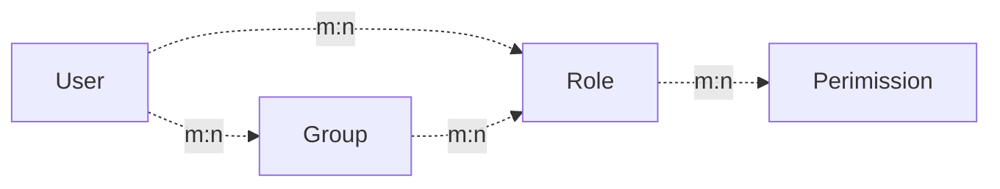

[简体中文](https://github.com/amisadmin/fastapi_user_auth/blob/master/README.zh.md)
| [English](https://github.com/amisadmin/fastapi_user_auth)

# 项目介绍

<h2 align="center">
  FastAPI-User-Auth
</h2>
<p align="center">
    <em>FastAPI-User-Auth是一个简单而强大的FastAPI用户RBAC认证与授权库.</em><br/>
    <em>基于FastAPI-Amis-Admin并提供可自由拓展的可视化管理界面.</em>
</p>
<p align="center">
    <a href="https://github.com/amisadmin/fastapi_amis_admin/actions/workflows/pytest.yml" target="_blank">
        
    </a>
    <a href="https://pypi.org/project/fastapi_user_auth" target="_blank">
        
    </a>
    <a href="https://pepy.tech/project/fastapi-user-auth" target="_blank">
        
    </a>
    <a href="https://gitter.im/amisadmin/fastapi-amis-admin">
        
    </a>
    <a href="https://jq.qq.com/?_wv=1027&k=U4Dv6x8W" target="_blank">
        
    </a>
</p>
<p align="center">
  <a href="https://github.com/amisadmin/fastapi_user_auth" target="_blank">源码</a>
  ·
  <a href="http://user-auth.demo.amis.work/" target="_blank">在线演示</a>
  ·
  <a href="http://docs.amis.work" target="_blank">文档</a>
  ·
  <a href="http://docs.gh.amis.work" target="_blank">文档打不开？</a>
</p>

------

`FastAPI-User-Auth`是一个基于 [FastAPI-Amis-Admin](https://github.com/amisadmin/fastapi_amis_admin)
的应用插件,与`FastAPI-Amis-Admin`深度结合,为其提供用户认证与授权.

## 安装

```bash
pip install fastapi-user-auth
```

## 简单示例

```python
from fastapi import FastAPI
from fastapi_amis_admin.admin.settings import Settings
from fastapi_user_auth.site import AuthAdminSite
from starlette.requests import Request
from sqlmodel import SQLModel

# 创建FastAPI应用
app = FastAPI()

# 创建AdminSite实例
site = AuthAdminSite(settings=Settings(database_url_async='sqlite+aiosqlite:///amisadmin.db'))
auth = site.auth
# 挂载后台管理系统
site.mount_app(app)

# 创建初始化数据库表
@app.on_event("startup")
async def startup():
    await site.db.async_run_sync(SQLModel.metadata.create_all, is_session=False)
    # 创建默认测试用户, 请及时修改密码!!!
    await auth.create_role_user('admin')
    await auth.create_role_user('vip')

# 要求: 用户必须登录
@app.get("/auth/get_user")
@auth.requires()
def get_user(request: Request):
    return request.user

if __name__ == '__main__':
    import uvicorn

    uvicorn.run(app, debug=True)

```

## 验证方式

### 装饰器

- 推荐场景: 单个路由.支持同步/异步路由.

```python
# 要求: 用户必须登录
@app.get("/auth/user")
@auth.requires()
def user(request: Request):
    return request.user  # 当前请求用户对象.

# 验证路由: 用户拥有admin角色
@app.get("/auth/admin_roles")
@auth.requires('admin')
def admin_roles(request: Request):
    return request.user

# 要求: 用户拥有vip角色
# 支持同步/异步路由
@app.get("/auth/vip_roles")
@auth.requires(['vip'])
async def vip_roles(request: Request):
    return request.user

# 要求: 用户拥有admin角色 或 vip角色
@app.get("/auth/admin_or_vip_roles")
@auth.requires(roles=['admin', 'vip'])
def admin_or_vip_roles(request: Request):
    return request.user

# 要求: 用户属于admin用户组
@app.get("/auth/admin_groups")
@auth.requires(groups=['admin'])
def admin_groups(request: Request):
    return request.user

# 要求: 用户拥有admin角色 且 属于admin用户组
@app.get("/auth/admin_roles_and_admin_groups")
@auth.requires(roles=['admin'], groups=['admin'])
def admin_roles_and_admin_groups(request: Request):
    return request.user

# 要求: 用户拥有vip角色 且 拥有`article:update`权限
@app.get("/auth/vip_roles_and_article_update")
@auth.requires(roles=['vip'], permissions=['article:update'])
def vip_roles_and_article_update(request: Request):
    return request.user

```

### 依赖项(推荐)

- 推荐场景: 单个路由,路由集合,FastAPI应用.

```python
from fastapi import Depends
from typing import Tuple
from fastapi_user_auth.auth import Auth
from fastapi_user_auth.auth.models import User

# 路由参数依赖项, 推荐使用此方式
@app.get("/auth/admin_roles_depend_1")
def admin_roles(user: User = Depends(auth.get_current_user)):
    return user  # or request.user

# 路径操作装饰器依赖项
@app.get("/auth/admin_roles_depend_2", dependencies=[Depends(auth.requires('admin')())])
def admin_roles(request: Request):
    return request.user

# 全局依赖项
# 在app应用下全部请求都要求拥有admin角色
app = FastAPI(dependencies=[Depends(auth.requires('admin')())])

@app.get("/auth/admin_roles_depend_3")
def admin_roles(request: Request):
    return request.user

```

### 中间件

- 推荐场景: FastAPI应用

```python
app = FastAPI()
# 在app应用下每条请求处理之前都附加`request.auth`和`request.user`对象
auth.backend.attach_middleware(app)

```

### 直接调用

- 推荐场景: 非路由方法

```python
from fastapi_user_auth.auth.models import User

async def get_request_user(request: Request) -> Optional[User]:
    # user= await auth.get_current_user(request)
    if await auth.requires('admin', response=False)(request):
        return request.user
    else:
        return None

```

## Token存储后端

`fastapi-user-auth` 支持多种token存储方式.默认为: `DbTokenStore`, 建议自定义修改为: `JwtTokenStore`

### JwtTokenStore

```python
from fastapi_user_auth.auth.backends.jwt import JwtTokenStore
from sqlalchemy.ext.asyncio import create_async_engine
from sqlalchemy_database import AsyncDatabase

# 创建异步数据库引擎
engine = create_async_engine(url='sqlite+aiosqlite:///amisadmin.db', future=True)
# 使用`JwtTokenStore`创建auth对象
auth = Auth(
    db=AsyncDatabase(engine),
    token_store=JwtTokenStore(secret_key='09d25e094faa6ca2556c818166b7a9563b93f7099f6f0f4caa6cf63b88e8d3e7')
)

# 将auth对象传入AdminSite
site = AuthAdminSite(
    settings=Settings(database_url_async='sqlite+aiosqlite:///amisadmin.db'),
    auth=auth
)

```

### DbTokenStore

```python
# 使用`DbTokenStore`创建auth对象
from fastapi_user_auth.auth.backends.db import DbTokenStore

auth = Auth(
    db=AsyncDatabase(engine),
    token_store=DbTokenStore(db=AsyncDatabase(engine))
)
```

### RedisTokenStore

```python
# 使用`RedisTokenStore`创建auth对象
from fastapi_user_auth.auth.backends.redis import RedisTokenStore
from aioredis import Redis

auth = Auth(
    db=AsyncDatabase(engine),
    token_store=RedisTokenStore(redis=Redis.from_url('redis://localhost?db=0'))
)
```

## RBAC模型

本系统采用的`RBAC`模型如下, 你也可以根据自己的需求进行拓展.

- 参考: [权限系统的设计](https://blog.csdn.net/qq_25889465/article/details/98473611)



## 高级拓展

```bash
### 拓展`User`模型

```python
from datetime import date

from fastapi_amis_admin.models.fields import Field
from fastapi_user_auth.auth.models import User

# 自定义`User`模型,继承`User`
class MyUser(User, table = True):
    point: float = Field(default = 0, title = '积分', description = '用户积分')
    phone: str = Field(None, title = '手机号', max_length = 15)
    parent_id: int = Field(None, title = "上级", foreign_key = "auth_user.id")
    birthday: date = Field(None, title = "出生日期")
    location: str = Field(None, title = "位置")

# 使用自定义的`User`模型,创建auth对象
auth = Auth(db = AsyncDatabase(engine), user_model = MyUser)
```

### 拓展`Role`,`Group`,`Permission`模型

```python
from fastapi_amis_admin.models.fields import Field
from fastapi_user_auth.auth.models import Group

# 自定义`Group`模型,继承`BaseRBAC`;覆盖`Role`,`Permission`模型类似,区别在于表名.
class MyGroup(Group, table=True):
    __tablename__ = 'auth_group'  # 数据库表名,必须是这个才能覆盖默认模型
    icon: str = Field(None, title='图标')
    is_active: bool = Field(default=True, title="是否激活")

```

### 自定义`UserAuthApp`默认管理类

默认管理类均可通过继承重写替换.
例如: `UserLoginFormAdmin`,`UserRegFormAdmin`,`UserInfoFormAdmin`,
`UserAdmin`,`GroupAdmin`,`RoleAdmin`,`PermissionAdmin`

```python
# 自定义模型管理类,继承重写对应的默认管理类
class MyGroupAdmin(admin.ModelAdmin):
    group_schema = None
    page_schema = PageSchema(label='用户组管理', icon='fa fa-group')
    model = MyGroup
    link_model_fields = [Group.roles]
    readonly_fields = ['key']

# 自定义用户认证应用,继承重写默认的用户认证应用
class MyUserAuthApp(UserAuthApp):
    GroupAdmin = MyGroupAdmin

# 自定义用户管理站点,继承重写默认的用户管理站点
class MyAuthAdminSite(AuthAdminSite):
    UserAuthApp = MyUserAuthApp

# 使用自定义的`AuthAdminSite`类,创建site对象
site = MyAuthAdminSite(settings, auth=auth)
```

## 界面预览

- Open `http://127.0.0.1:8000/admin/auth/form/login` in your browser:


- Open `http://127.0.0.1:8000/admin/` in your browser:


- Open `http://127.0.0.1:8000/admin/docs` in your browser:


## 许可协议

- `fastapi-amis-admin`基于`Apache2.0`开源免费使用，可以免费用于商业用途，但请在展示界面中明确显示关于FastAPI-Amis-Admin的版权信息.

## 鸣谢

感谢以下开发者对 FastAPI-User-Auth 作出的贡献：

<a href="https://github.com/amisadmin/fastapi_user_auth/graphs/contributors">
  
</a>

